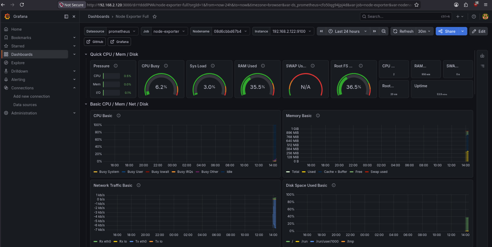
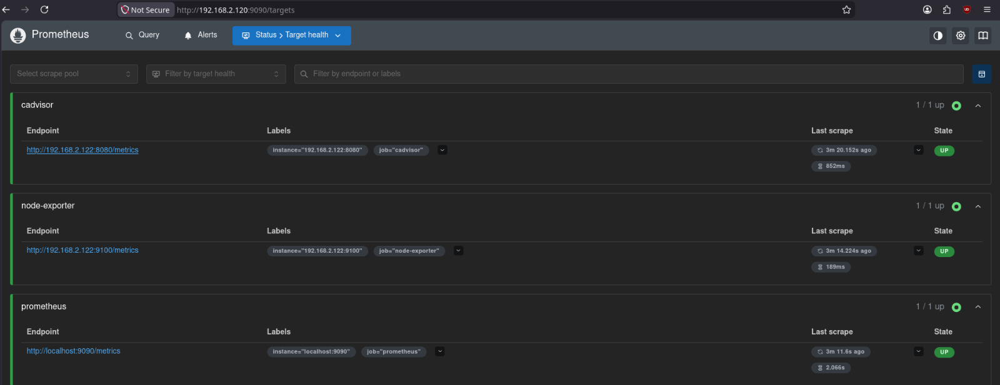
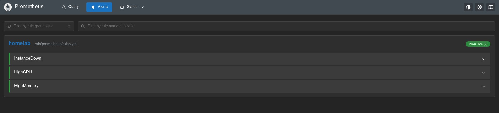
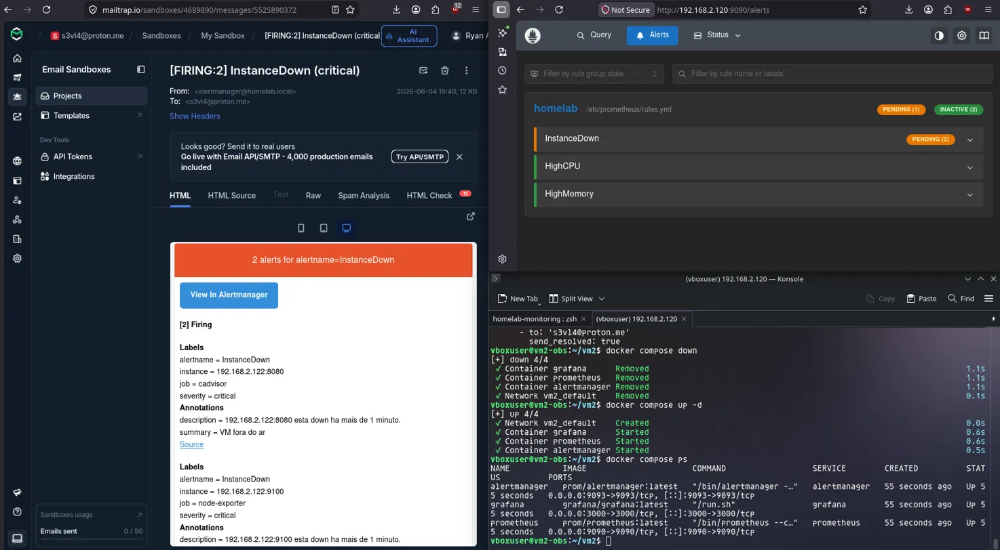

# homelab-monitoring

Two VMs on the same local network — one exposing system metrics, the other collecting, storing and visualizing them. Alerts fire when something goes wrong.

## How it works

```
VM1 — target                       VM2 — observability
────────────────────               ──────────────────────────
Node Exporter  :9100   ──────────► Prometheus  :9090
cAdvisor       :8080   ──────────► Alertmanager :9093
                                   Grafana      :3000
```

Prometheus scrapes VM1 every 15 seconds. Grafana reads from Prometheus. Alertmanager sends email when a rule fires.

## Stack

| Service | Role | Port |
|---|---|---|
| Node Exporter | Host metrics — CPU, memory, disk, network | 9100 |
| cAdvisor | Docker container metrics | 8080 |
| Prometheus | Collects, stores and evaluates alert rules | 9090 |
| Alertmanager | Email notifications | 9093 |
| Grafana | Dashboards | 3000 |

## Alerting

Rules defined in `vm2/prometheus/rules.yml`:

| Alert | Condition | Severity |
|---|---|---|
| InstanceDown | Target down for 1 minute | critical |
| HighCPU | CPU above 80% for 2 minutes | warning |
| HighMemory | Memory above 85% for 2 minutes | warning |

Email on fire, email on resolve.

## Project structure

```
homelab-monitoring/
├── vm1/
│   └── docker-compose.yml
└── vm2/
    ├── docker-compose.yml
    └── prometheus/
        ├── prometheus.yml
        └── rules.yml
```

`vm2/alertmanager/alertmanager.yml` is gitignored — contains SMTP credentials.

## Setup

**VM1:**
```bash
git clone https://github.com/s3vla/homelab-monitoring.git
cd homelab-monitoring/vm1
docker compose up -d
```

**VM2:**

Edit `vm2/prometheus/prometheus.yml` — replace `IP_DA_VM1` with the actual VM1 IP:

```yaml
- targets: ["VM1_IP:9100"]
- targets: ["VM1_IP:8080"]
```

Create `vm2/alertmanager/alertmanager.yml` with your SMTP credentials:

```yaml
global:
  smtp_smarthost: 'your-smtp-host:587'
  smtp_from: 'alertmanager@homelab.local'
  smtp_auth_username: 'your-username'
  smtp_auth_password: 'your-password'
  smtp_require_tls: true

route:
  receiver: 'email'
  group_by: ['alertname']
  group_wait: 30s
  group_interval: 5m
  repeat_interval: 1h

receivers:
  - name: 'email'
    email_configs:
      - to: 'your@email.com'
        send_resolved: true
```

```bash
cd homelab-monitoring/vm2
docker compose up -d
```

## Access

| Service | URL |
|---|---|
| Grafana | http://VM2_IP:3000 |
| Prometheus | http://VM2_IP:9090 |
| Alertmanager | http://VM2_IP:9093 |

Default Grafana credentials: `admin` / `admin123`

## Dashboard

Node Exporter Full (ID: 1860) from Grafana.com.

## Requirements

- Two VMs with Ubuntu Server
- Docker and Docker Compose on both
- Same local network (Bridge Adapter on VirtualBox)

## Screenshots





